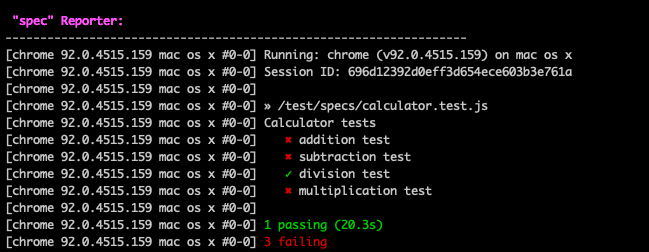

<!-- @format -->

# Calculator Automation Script

This automation framework covers the following test cases for calculator

- Addition
- Multiplication
- Subtraction
- Division

## Tech stack

- JavaScript
- Webdriver.io
- mocha
- spec reporter

## Steps to run test

- Clone the repo ~ `https://github.com/amartanwar42/GoCo_Calculator_Test.git`
- `npm install`
- `npm run test`

## Report from last run

## Test cases

- Verify if all the number are correctly displayed upon click. (0-9)
- Verify if symbols are correctly displayed on the screen when user press the +, -, /, \*, .
- Verify if screen clears when user press the c button.
- Verify if addition of two numbers is working.
- Verify if addition of two decimal numbers is working fine.
- Verify if addition of multiple numbers is working fine.
- Verify if subtraction of two numbers is working.
- Verify if subtraction of two decimal numbers is working fine.
- Verify if subtraction of multiple numbers is working fine.
- Verify if multiplication of two numbers is working.
- Verify if multiplication of two decimal numbers is working fine.
- Verify if multiplication of multiple numbers is working fine.
- Verify if division of two numbers is working.
- Verify if division of two decimal numbers is working fine.
- Verify if BODMAS (BIDMAS) rules are followed by the calculator.
- Verify the result when user performs 10/0.
- Verify the result when user performs 0/0.

## Bugs

- Number 2 is visible as 4 on the screen.
- '+' is displayed as '-' on the screen and its performing subtraction.
- '-' is displayed as '+' on the screen and its performing addition.
- Multiplication is not working.
- Able to enter (.) multiple times. (Ex 2...3..4 )
- Able to enter multiple action buttons together. (Ex 23+/\*-)
- Able to enter any text from keyboard. (Ex asfw34sf)

## JIRA issue

**Title**: '+' is displayed as '-' on the screen and its performing subtraction

**Steps to reproduce**:

- Open the calculator
- Press 3
- Press +
- Press 4
- Press =

**Actual Result**: '+' is displayed as '-' and subtraction is performed instead of addition.

**Expected Result**: '+' is displayed as '+' and addition should be performed
